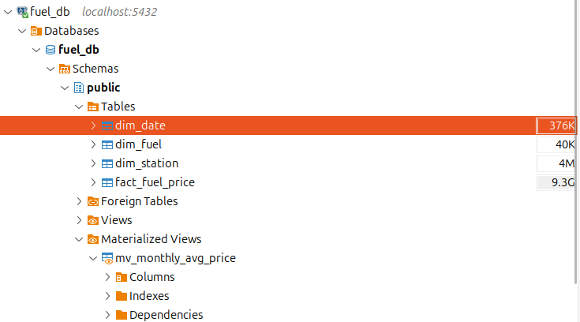

# Fuel-Price-Open-Data

Ce projet vise à pratiquer l'exploitation de données publiques ouvertes sur le prix des carburants en France. L'architecture repose sur PostgreSQL pour le schéma relationnel et Python pour la collecte (API/XML) et le traitement. L'objectif est d'expérimenter l'ingestion de données pour bâtir une base pérenne, contrôlée et performante.

Les données proviennent de l'API officielle des prix des carburants en France :
- HIstorique : https://www.prix-carburants.gouv.fr/rubrique/opendata/

- API : https://data.economie.gouv.fr/api/explore/v2.1/catalog/datasets/prix-des-carburants-en-france-flux-instantane-v2/records .

## Structure du projet 

```plaintext
Fuel-Price-Open-Data/
├── .streamlit/            # Configuration Streamlit & Secrets (API Keys)
├── data/                  # Données locales
│   ├── raw/               # Stockage temporaire (XML Historique)
│   └── departements.json  # Config départements cibles
├── sql/                   # Scripts SQL (Schéma, Index, Vues)
├── src/                   # Code source Python
│   ├── dashboard/         # Visualisation (Streamlit, Cartes, IA)
│   ├── extract/           # Acquisition (API Client & Scrapper XML)
│   ├── transform/         # Parsers JSON & XML
│   ├── load/              # Chargement BDD (SQLAlchemy, Upserts)
│   ├── import_history.py  # Script ingestion Batch (2015-2025)
│   └── main.py            # Orchestrateur ETL quotidien
├── app.py                 # Point d'entrée Web
├── poetry.lock            # Verrouillage des versions
└── pyproject.toml         # Dépendances du projet
```

## Installation et Exécution

### Pré-requis 

- Python 3.10+ (https://www.python.org/downloads/)

- PostgreSQL (https://www.postgresql.org/download/)

- Poetry (gestionnaire de paquets) [https://python-poetry.org/]

### Mise en place

1. **Installation des dépendances :**

    ```bash
    poetry install
    ```

2. **Configuration de la Base de Données :** 

    Connectez-vous à votre serveur PostgreSQL et exécutez les commandes suivantes (à effectuer une seule fois) :

    ```sql
    -- Création de l'utilisateur dédié
    CREATE USER user_fuel WITH PASSWORD 'open-data@fuel';

    -- Création de la base
    CREATE DATABASE fuel_db OWNER user_fuel;

    -- Attribution des privilèges
    GRANT ALL PRIVILEGES ON DATABASE fuel_db TO user_fuel;
    ```

    Ensuite, initialisez le schéma (tables, dimensions, faits) via un client SQL (DBeaver ou psql) en exécutant les scripts du dossier `sql/`.

3. **Configuration des secrets (api) :**

    Créer un fichier .streamlit/secrets.toml :

    ```toml
    GEMINI_API_KEY = "votre_cle_api"
    ```

4. **Lancement de l'ETL (Historique ou Temps Réel) :**

    ```Bash
    # Pour l'historique XML
    poetry run python src/import_history.py

    # Pour la mise à jour API
    poetry run python src/main.py
    ```

5. **Lancement du Dashboard :**

    ```Bash
    poetry run streamlit run app.py
    ```

---

## Architecture & Choix Techniques

Cette section détaille la conception logique du projet.

### 1. Modélisation des Données (Schéma en Étoile)

Afin d’optimiser les performances de lecture analytique (OLAP), la base de données `fuel_db` est structurée selon un modèle dimensionnel.

#### Table de Faits : `fact_fuel_price`

Contient les mesures (> 47M lignes).

- Clés étrangères : `station_id`, `fuel_id`, `date_id`  
- Mesure : `price_value` (prix du carburant)  
- Métadonnée : `update_time`  

#### Dimensions : `dim_*`

Apportent le contexte analytique.

- `dim_station` : Unicité et géolocalisation des points de vente  
- `dim_fuel` : Typologie (Gazole, SP95, etc.)  
- `dim_date` : Agrégations temporelles  



*Aperçu de la base de données : on note la table de faits de 9.3 Go et la vue matérialisée pour l'optimisation.*

---

### 2. Stratégie d’Ingestion Hybride (ETL)

Le pipeline assure à la fois l’historique profond et la fraîcheur des données.

#### Ingestion Historique (Batch)

- Traitement des archives XML (2015–2025)  
- Streaming par lots de 5000 lignes  
- Prévention de la saturation mémoire  

#### Ingestion Temps Réel (API)

- Collecte journalière via API REST  
- Pagination automatique  
- Mécanisme d’Upsert pour gérer conflits et doublons  

---

### 3. Optimisation & Calculs

#### Performance SQL

- Index B-Tree  
- Vues matérialisées (`mv_monthly_avg_price`)  
- Transformation de requêtes coûteuses en lectures rapides (< 100 ms)  

#### Moyenne Pondérée

Pour éviter les biais géographiques, les prix moyens sont pondérés par le volume de relevés selon la formule :

$$
P_{pondéré} = \frac{\sum (Prix_{i} \times Volume_{i})}{\sum Volume_{i}}
$$

---
